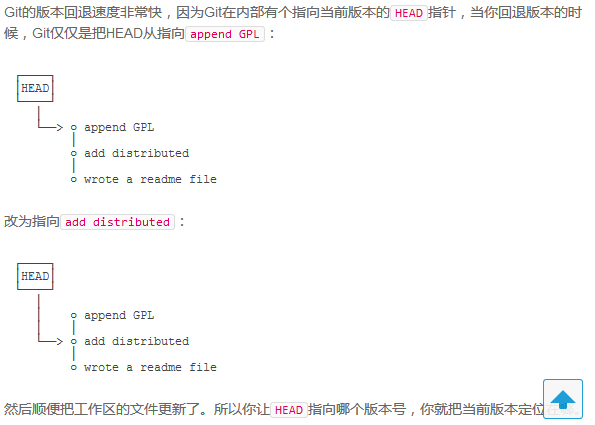
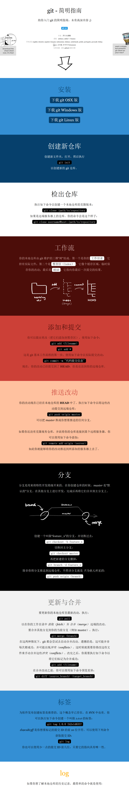

## Primer turorial for the git commands  
References from [https://blog.csdn.net/zhangxiaoyang0/article/details/79286825](https://blog.csdn.net/zhangxiaoyang0/article/details/79286825)

## Git pulls remote branches and creates local branches
View remote branches  
`git branch -r`  
View remote branches and local branches  
`git branch -a`  
View local branches  
`git branch`

## create local branches
`git checkout -b local-branch origin/remote-branch`  
`git fetch local-branch:remote-branch`  
*Note*: This method will create a new branch x locally, but will not automatically switch to the local branch X. Manual checkout is required. Local branches established by this method do not map to remote branches.

## Establishing Mapping Relations between local-branches and remote-branches
View Mapping Relations between local-branches and remote-branches.  
`git branch -vv`  
create Mapping  
`git branch -u origin/remote-branches`  
or  
`git branch --set-upstream-to origin/remote-branches`  
*Note*: origin is a sign of GIT address, which establishes the mapping relationship between the current branch and the remote branch.  
Revoke mapping relationship between local branch and remote branches  
`git branch --unset-upstream`

## Back Branch Version
References from [Liao Xuefeng](https://www.liaoxuefeng.com/wiki/896043488029600/897013573512192)

View log history  
`git log --pretty=oneline`  
View command history
`git reflog`
back history Version
`git reset --hard id_num`

